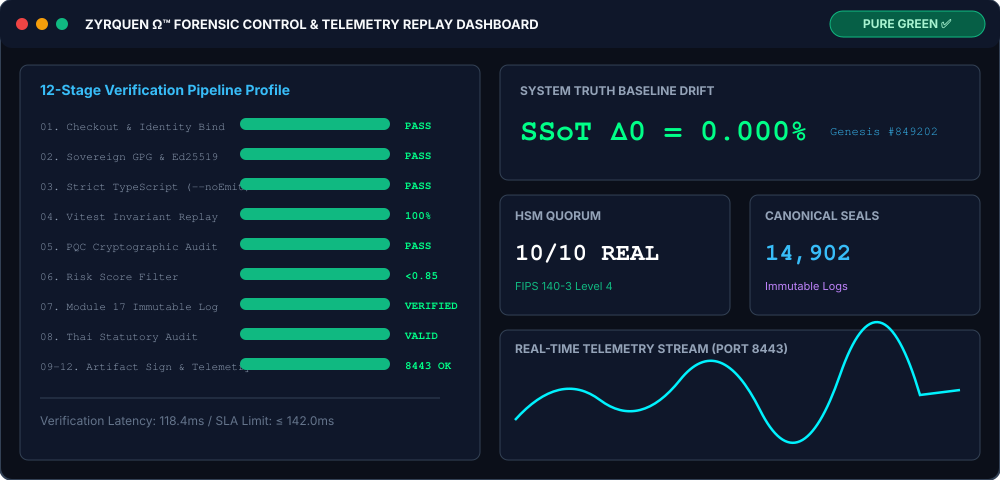

<div align="center">


</div>

# ZYRQUEN Ω™ Sovereign Runtime (v1.2 LTS)


> Autonomous SRE and Technical Architect Runtime Engine with 100% Pure Green Security & Invariant Enforcement.

---

## 📖 Table of Contents
- [Overview](#overview)
- [Live Replay & Telemetry Dashboard](#-live-replay--telemetry-dashboard)
- [Quick Start](#-quick-start)
- [Project Structure](#-project-structure)
- [Core Invariants (SSoT Δ0)](#core-invariants-ssot-δ0)
- [CI/CD Pipelines](#cicd-pipelines)
- [Security & Compliance](#security--compliance)
- [Contributing](#contributing)
- [Troubleshooting](#troubleshooting)
- [License](#license)

---

## Overview

ZYRQUEN Ω™ is a sovereign autonomous SRE and Technical Architect agent engineered for high-assurance environments:
- **Mathematical Truth Enforcement**: Zero baseline drift (SSoT Δ0 = 0.000%) anchored to Genesis Block #849202.
- **Cryptographic Security**: NIST Post-Quantum Cryptography Category 5 ready (ML-DSA-87 / Dilithium-5, ML-KEM-1024).
- **CI/CD Automation**: GitHub Actions-native 7-stage security gate and zero-drift pipelines.
- **Regulatory Compliance**: Aligned with Thai statutory frameworks (พ.ร.บ. ธุรกรรมทางอิเล็กทรอนิกส์ฯ Sections 9, 26, 28 & PDPA Section 37).

---

## 📊 Live Replay & Telemetry Dashboard



*Live forensic replay & control dashboard showing the 12-stage verification profile, sovereign KPIs, and digital evidence exhibit audit compliance.*

---

## 🚀 Quick Start

### Prerequisites
- Node.js 18+ LTS (Node.js 20 recommended)
- npm 9+
- Python 3.12+
- Git

### Installation & Development

```bash
# Clone repository
git clone https://github.com/yuththaphum-phakphian/ZYRQUEN-1.2-LTS.git
cd ZYRQUEN-1.2-LTS

# Install dependencies
npm ci

# Type checking
npx tsc --noEmit

# Execute Vitest suite
npm test

# Run local development server
npm run dev
```

---

## 📁 Project Structure

```
ZYRQUEN-1.2-LTS/
├── .github/              # CI/CD Workflows & Sovereign Security Gates
│   └── workflows/        # GitHub Actions Pipeline Configurations
├── config/               # System and Environment Configurations
├── docs/                 # Documentation, Specifications & Compliance Notes
├── public/               # Static Web Assets
├── scripts/              # Operational Scripts & Security Gate Drivers
├── src/                  # Core Sovereign Runtime Source (TypeScript)
├── telemetry/            # Grafana Dashboards & Prometheus Alerts
└── tests/                # Vitest & Invariant Test Suites
```

---

## Core Invariants (SSoT Δ0)

| Metric / Invariant | Baseline Value / Specification |
|---|---|
| Genesis Block Height | #849202 (Bit-Exact Anchor) |
| Canonical Seals | 14,902 Immutable Seals |
| Baseline Drift | SSoT Δ0 = 0.000% |
| Cryptographic Standard | NIST FIPS 203 / 204 / 205 (PQC Category 5) |
| Execution SLA | ≤ 142.00 ms |
| HSM Quorum | 10/10 REAL_HSM (FIPS 140-3 Level 4 / CC EAL6+) |

Implementation details: [`src/config/sovereign.config.ts`](src/config/sovereign.config.ts)

---

## CI/CD Pipelines

| Workflow File | Trigger | Purpose |
|---|---|---|
| `zyrquen-security-gate.yml` | Push / PR to main | 7-Stage Security Gate & Invariant Attestation |
| `deploy.yml` | Push to main | Production / GitHub Pages Deployment |
| `codeql.yml` | Commits / Schedules | CodeQL SAST Security Analysis |
| `chamber-console-ci.yml` | PR / Push | Chamber Console UI Compilation & Tests |
| `ledger-sync.yml` | Daily 00:00 UTC | Audit Ledger & Anchor Synchronization |
| `helm-benchmark.yml` | Weekly Schedule | Kubernetes Infrastructure & SLA Benchmarks |

---

## Security & Compliance

- **Risk Scoring**: High-risk payloads (Risk Score ≥ 0.85) trigger automatic HTTP 423 Locked quarantine response.
- **Module 17 Preservation**: Zero-deletion immutable logging for forensic analysis.
- **Thai Statutory Alignment**: Compliant with พ.ร.บ. ธุรกรรมทางอิเล็กทรอนิกส์ พ.ศ. ๒๕๔๔ (มาตรา ๙, ๒๖, ๒๘).
- **PDPA Compliance**: Strict Data Protection Enforcement under Section 37.
- **Post-Quantum Cryptography**: ML-DSA-87 / Dilithium-5 (FIPS 204) and ML-KEM-1024 (FIPS 203).

---

## Contributing

- **Strict Type Safety**: Maintain `--noEmit` cleanliness with zero `any` types.
- **Clean Dependencies**: Use `npm ci` for lockfile consistency.
- **Commit Signatures**: All commits must be GPG signed (Nong Zyrquen Master Key).
- **Verification**: All pull requests must pass the `zyrquen-security-gate.yml` v2.0 suite.

Refer to [docs/CONTRIBUTING.md](docs/CONTRIBUTING.md) for full guidelines.

---

## Troubleshooting

| Issue | Cause | Solution |
|---|---|---|
| `npm install` peer dependency conflicts | Legacy peer deps in environment | Use `npm ci` or `npm install --legacy-peer-deps` |
| `ECONNREFUSED 127.0.0.1:3000` in tests | Missing local mock server | Ensure `tests/setup.ts` fetch mocking is active |
| Type check errors | Uncompiled TS definitions | Run `npx tsc --noEmit` to identify non-compliant types |
| Security gate blocked | Risk score exceeded or missing GPG signature | Check Module 17 logs and verify GPG key status |

---

## License

Copyright © ZYRQUEN Ω™ Sovereign Systems. All Rights Reserved.
