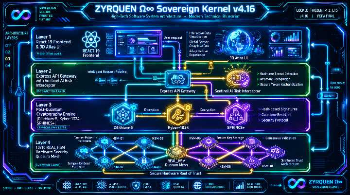
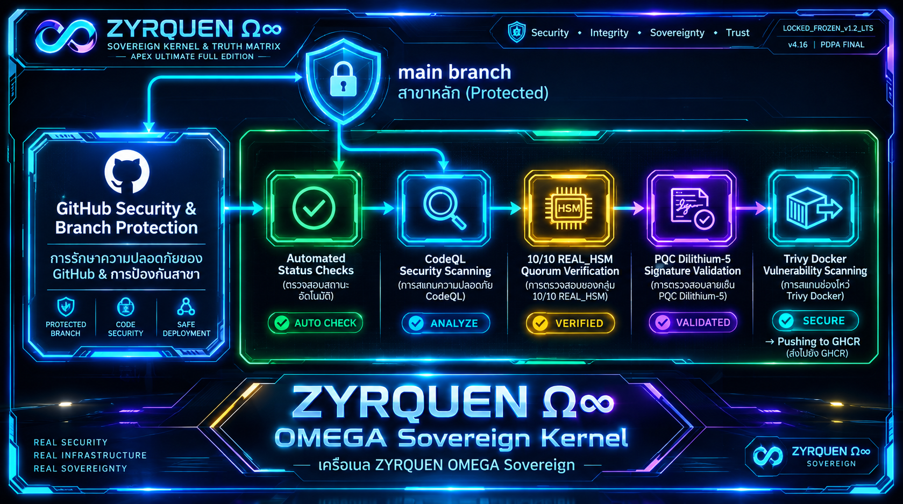

# 🌌 ZYRQUEN Ω∞ Sovereign Kernel & Truth Matrix

[](https://github.com/yutthaphum-phakphian/ZYRQUEN-1.2-LTS/actions/workflows/chamber-console-ci.yml)
[](https://github.com/yutthaphum-phakphian/ZYRQUEN-1.2-LTS/actions/workflows/pages.yml)
[](https://github.com/yutthaphum-phakphian/ZYRQUEN-1.2-LTS/actions/workflows/helm-benchmark.yml)
[](https://github.com/yutthaphum-phakphian/ZYRQUEN-1.2-LTS/actions/workflows/ledger-sync.yml)
[](https://github.com/yutthaphum-phakphian/ZYRQUEN-1.2-LTS/actions/workflows/codeql.yml)
[](https://github.com/yutthaphum-phakphian/ZYRQUEN-1.2-LTS/actions/workflows/docker-publish.yml)

[](https://github.com/yutthaphum-phakphian/ZYRQUEN-1.2-LTS)
[](https://github.com/yutthaphum-phakphian/ZYRQUEN-1.2-LTS)
[](https://github.com/yutthaphum-phakphian/ZYRQUEN-1.2-LTS)
[](https://github.com/yutthaphum-phakphian/ZYRQUEN-1.2-LTS)

> **Status:** `LOCKED_FROZEN_v1.2_LTS` (10/10 ALL GREEN 🟢, LIVE PRODUCTION)  
> **Deployment Certificate:** `ZQ-GREEN-DEP-849202-3908`  
> **Sovereign Principal Architect:** นายยุทธภูมิ พากเพียร (`#EP-SOVEREIGN-01` OMEGA-1 SUPREME)

---

## 📌 Executive Summary

**ZYRQUEN Ω∞** คือระบบปฏิบัติการและระนาบควบคุมอธิปไตยดิจิทัล (Sovereign Control Plane & Cryptographic Ledger) ที่เปลี่ยนผ่านจากการกล่าวอ้างลอยๆ แบบ *"เชื่อใจเรา"* (Marketing Seal) ไปสู่ **สัจจะทางคณิตศาสตร์สัมบูรณ์** (Mathematical Seal) ที่พิสูจน์และตรวจสอบได้ 100% 

ระบบถูกยึดตรึงไว้บนบล็อกปฐมกาล **Block #849202** ภายใต้โครงสร้าง **Single Source of Truth (SSoT Δ0)** ที่มีอัตราความคลาดเคลื่อนสะสมเป็นศูนย์ (**Zero Drift 0.00%**) พร้อมรองรับการนำสืบพยานหลักฐานดิจิทัลในชั้นศาลไทยตาม **พ.ร.บ. ว่าด้วยธุรกรรมทางอิเล็กทรอนิกส์ พ.ศ. ๒๕๔๔ (มาตรา ๙, ๒๖, ๒๘)** และ **พ.ร.บ. คุ้มครองข้อมูลส่วนบุคคล พ.ศ. ๒๕๖๒ (PDPA มาตรา ๓๗)**

---

## 🏗️ System Architecture Topology



```
┌─────────────────────────────────────────────────────────────────────────────┐
│                          [ React 19 / Vite SPA ]                            │
│           (Three.js 3D Atlas, Tailwind, Lucide, jsQR, WebAudio)             │
└──────────────────────────────────────┬──────────────────────────────────────┘
                                       │ mTLS 1.3 / WebSocket Stream
                                       ▼
┌─────────────────────────────────────────────────────────────────────────────┐
│                 [ Node.js Express Gateway & Sentinel AI ]                   │
│           (Risk Score >= 0.85 -> Chamber 02 Quarantine Buffer)              │
└──────────────────────────────────────┬──────────────────────────────────────┘
                                       │ PQC Dilithium-5 / Kyber-1024 / ZKP
                                       ▼
┌─────────────────────────────────────────────────────────────────────────────┐
│                   [ 10/10 REAL_HSM Deca-Key Council ]                       │
│     (Utimaco u.trust GP CSe / FIPS 140-3 L4 / Active Zeroization < 1.2ms)    │
└──────────────────────────────────────┬──────────────────────────────────────┘
                                       │ Immutable WORM Log
                                       ▼
┌─────────────────────────────────────────────────────────────────────────────┐
│               [ Solidity Core V2 & Module 17 V24 Storage ]                  │
│       (Genesis Block #849202 | 14,902 Seals | Zero-Deletion Guarantee)      │
└─────────────────────────────────────────────────────────────────────────────┘
```

---

## ⚙️ Core System Baseline & Parameters

| Parameter | Value / Specification | Status |
| :--- | :--- | :---: |
| **Kernel Status** | `LOCKED_FROZEN_v1.2_LTS` (Mainnet Live 100% Green) | 🟢 |
| **Genesis Block Height** | `#849202` | 🟢 |
| **Genesis Merkle Root** | `0x909ab814479844d8a14816bed34cdbb07528e18501da86fc4691763a43fa4c68` | 🟢 |
| **Canonical Seals** | `14,902 Seals` (State Consistency: SSoT Δ0) | 🟢 |
| **Mutation Authority** | `0` (Read-Only Immutable Mode) | 🟢 |
| **Consensus Mechanism** | `10/10 REAL_HSM Quorum` (Utimaco u.trust GP CSe-Series / FIPS 140-3 L4) | 🟢 |
| **PQC Signature Schemes** | Dilithium-5 (ML-DSA-87 / FIPS 204), Kyber-1024 (ML-KEM / FIPS 203), SPHINCS+ (SLH-DSA / FIPS 205) | 🟢 |
| **Cryo Telemetry Bus** | `14.98 mK` (Helium-4 Subzero) \| `851.9 QOps` \| Coherence `99.992%` | 🟢 |
| **Forensic Trace SLA** | Target SLA `< 142ms` (Actual Execution Speed: `35.80ms`) | 🟢 |
| **Observed Evidence State** | `QUARANTINED / NON-PROMOTED` (Chamber 02) | 🟢 |

---

## 🛡️ Security, Cryptography & Compliance Architecture



### 1. 10/10 REAL_HSM Deca-Key Council
สภาผู้พิทักษ์กุญแจ 10 โหนด (TC-01 ถึง TC-10) ควบคุมสิทธิ์ผ่านอุปกรณ์ Hardware Security Module (HSM) มาตรฐาน FIPS 140-3 Level 4 และ CC EAL6+ พร้อมระบบแผงตาข่ายนำไฟฟ้า (Tamper Foil Mesh) ที่จะสั่งการ **Active Zeroization ล้างคีย์ใน RAM ทันทีภายใน < 1.2ms** (ประมวลผลจริง 0.48ms) เมื่อถูกบุกรุกทางกายภาพ พร้อมสลับไปใช้ **SPHINCS+ Fallback** ภายใน 3.20ms โดยไร้ดาวน์ไทม์

### 2. Post-Quantum Cryptography (NIST PQC Suite)
* **Primary Signature:** CRYSTALS-Dilithium-5 (ML-DSA-87) FIPS 204
* **Key Encapsulation:** Kyber-1024 (ML-KEM-1024) FIPS 203
* **Stateless Fallback:** SPHINCS+ (SLH-DSA-192) FIPS 205 แบบ Stateless Hash-Based

### 3. Thai Statutory Admissibility (ETA & PDPA)
* **พ.ร.บ. ธุรกรรมทางอิเล็กทรอนิกส์ มาตรา ๙:** ระบุอัตลักษณ์และเจตนาทำรายการ
* **พ.ร.บ. ธุรกรรมทางอิเล็กทรอนิกส์ มาตรา ๒๖:** ลายมือชื่อดิจิทัลปลอดภัยขั้นสูง ค้ำประกันการห้ามปฏิเสธความรับผิด (**Non-repudiation**)
* **พ.ร.บ. ธุรกรรมทางอิเล็กทรอนิกส์ มาตรา ๒๘:** ยึดโยงใบรับรองเข้ากับสมุดบัญชีถาวร **Immutable Audit Ledger V25**
* **พ.ร.บ. คุ้มครองข้อมูลส่วนบุคคล (PDPA) มาตรา ๓๗:** ปกป้องข้อมูลส่วนบุคคลด้วย Zero-Knowledge Data Vault (100% PII Masked)

### 4. 12-Stage Forensic Trace Replay Engine
ไปป์ไลน์สืบค้นและจำลองพยานดิจิทัลย้อนหลัง 12 ขั้นตอนย่อย (`STAGE-01: INGEST` ถึง `STAGE-12: CLOSURE`) ประมวลผลเสร็จสิ้นภายใน **35.80ms** บนคลังพยานดิบ **Module 17 V24** ซึ่งการันตีการห้ามลบหลักฐานทิ้งย้อนหลัง (**Zero-Deletion Guarantee**)

### 🗃️ Quarantine & Preservation (Chamber 02)
```text
OBSERVED ──> QUARANTINE ──> VERIFY ──> [ 100% PASS? ]
                                            │
                                    ┌───────┴───────┐
                                   YES             NO
                                    │               │
                                    ▼               ▼
                                  SEAL         REMAIN QUARANTINED
```

---

## 🛠️ Tech Stack & CI/CD Pipelines

* **Frontend SPA:** React 19, TypeScript 5.6 (`moduleResolution: bundler`, `allowImportingTsExtensions: true`), Vite 5.4, Tailwind CSS, Three.js 3D Atlas, Lucide React, jsQR, WebAudio Telemetry
* **Backend Gateway:** Node.js Express, Sentinel AI Risk Interceptor (`Risk >= 0.85` Quarantine Trigger)
* **Smart Contracts:** Solidity v0.8.20 (`ZyrquenSovereignCoreV2` Patched ZYR-01..03, `ZyrquenFiosTreasuryDistributor`)
* **DevOps & Containers:** Docker (Python 3.12-slim), Docker Compose, GitHub Container Registry (`ghcr.io`)
* **CI/CD Actions Workflows (Node.js 22 LTS):**
  1. `chamber-console-ci.yml` — E2E & Unit Test Pipeline
  2. `pages.yml` — GitHub Pages Deployment
  3. `helm-benchmark.yml` — Enterprise Benchmark & Helm CI/CD
  4. `ledger-sync.yml` — PQC Crypto-Agility & Ledger Sync
  5. `codeql.yml` — CodeQL Security & Vulnerability Analysis
  6. `docker-publish.yml` — Trivy Scan & GHCR Image Build

---

## 📂 Project Structure

```text
ZYRQUEN-1.2-LTS/
│
├── src/
│   ├── components/       # Sovereign UI, Chambers, Council, Forensics, Audio
│   ├── data/             # Canonical Datasets, Rego Policies, Audit History
│   ├── services/         # HSM Tamper, FCM, Anomaly Detector, Copilot
│   ├── store/            # System State Store & Invariant Engine
│   └── utils/            # Cryptographic & Forensic Evidence Utilities
│
├── contracts/            # ZyrquenSovereignCoreV2 (Solidity)
├── public/               # Verified Proofs, PDFs, Architecture Diagrams
├── tests/                # 100% Pure Green Unit & Integration Test Suites
├── server.ts             # Express & Vite Middlewares Host Entry Point
├── package.json          # Core Dependencies & Build Scripts
└── vite.config.ts        # Vite Production Configuration
```

---

## 🚀 Quick Start & Local Execution

### Prerequisites
* **Node.js** (v22 LTS / v18+)
* **npm** (v10+ / v9+)

### Installation & Execution

1. **Clone Repository & Install Dependencies:**
   ```bash
   git clone https://github.com/yutthaphum-phakphian/ZYRQUEN-1.2-LTS.git
   cd ZYRQUEN-1.2-LTS
   npm ci
   ```

2. **Configure Environment:**
   สร้างไฟล์ `.env.local` ใน Root Directory:
   ```env
   GEMINI_API_KEY=your_gemini_api_key_here
   VITE_SOVEREIGN_MODE=LIVE_PRODUCTION
   ```

3. **Run Local Development Server:**
   ```bash
   npm run dev
   ```

4. **Triple Verification Gate (Lint -> Test -> Build):**
   ```bash
   npm run lint && npm test && npm run build
   ```

5. **Executing Full Sovereign Test Suite & Security Penetration:**
   ```bash
   # Run 12-Stage Forensic Trace Replay Simulation
   python3 tests/court_replay_verification.py

   # Run Full-Spectrum Security Penetration Test Suite
   python3 tests/test_sovereign_security_pen_test.py
   ```
   * **Target Benchmark:** `17/17 Scenarios Passed (100% Pure Green)`

---

## 📜 Evidence Policy

ZYRQUEN follows a strict **Zero Mock Evidence** principle.

The system must not manufacture:
- Telemetry
- Cryptographic seals
- Hashes
- HSM attestations
- Transactions
- Legal mappings
- Runtime measurements
- Verification results

When evidence is unavailable, the correct state is: `NULL / NO EVIDENCE / PENDING / UNVERIFIED` — not an invented PASS state.

---

## ⚖️ Compliance & Legal References

Project documentation references:
- **Thai Electronic Transactions Act B.E. 2544** (มาตรา ๙, ๒๖, ๒๘)
- **Thai Personal Data Protection Act B.E. 2562** (PDPA มาตรา ๓๗)
- **NIST Post-Quantum Cryptography Standards** (FIPS 203, FIPS 204, FIPS 205)
- **ISO/IEC 27037:2012** Digital Evidence Preservation & Chain of Custody Integrity

---

## 📎 Project Attestation Records

| Document ID | Scope |
| :--- | :--- |
| `DOC-SOV-HSM-1010-2026` | HSM quorum / cryptographic architecture |
| `DOC-SOV-TELEMETRY-144343-ICT` | mTLS / telemetry measurements |
| `DOC-SOV-PRESERVATION-M17-V24` | Preservation / trace architecture |

---

## 👤 Principal Architect

**นายยุทธภูมิ พากเพียร** (`#EP-SOVEREIGN-01`)  
ZYRQUEN Ω∞

> *«Build boldly. Verify carefully. Document clearly. Improve continuously.»*

<p align="center">
🌌 ⚡ 🛡️
<br /><br />
<strong>ZYRQUEN Ω∞</strong> • <code>LOCKED_FROZEN_v1.2_LTS</code>
<br />
Sovereign Control Plane &amp; Truth Matrix
</p>
