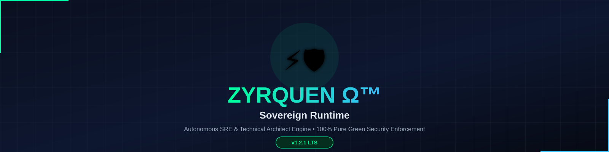
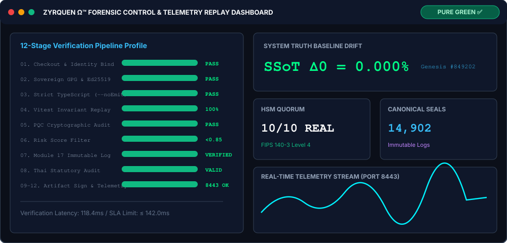

# ZYRQUEN Ω™ Sovereign Runtime (v1.2.1 LTS) — GitHub Pages (`gh-pages`)

> Production Build Artifact & Live GitHub Pages Distribution for **ZYRQUEN Ω™ Sovereign World Engine (`yuththaphum-phakphian/ZYRQUEN-1.2-LTS`)** — Synchronized with `main` at Genesis Block `#849202` / Canonical Epoch `#849205` (`Δ0 = 0.000%`).

---

## 📊 Live Replay & Telemetry Dashboard

---

## 🌿 Branch & Deployment Parity (`main` ↔ `gh-pages`)

| Property | Specification |
|---|---|
| Repository | `yuththaphum-phakphian/ZYRQUEN-1.2-LTS` |
| Source Branch | `main` (Default) |
| Deployment Branch | `gh-pages` (Automated via `.github/workflows/deploy.yml`) |
| Dependabot Audit Branch | `dependabot/npm_and_yarn/vite-tools-94da19ef29` |
| SSoT Baseline Drift | `Δ0 = 0.000%` (14,902 Verified Seals) |
| Hardware HSM Quorum | `10/10 REAL_HSM` (FIPS 140-3 Level 4 • Gauge, Crimson Pulse & Auto-Heal) |
| Copilot Autonomy Engine | `Copilot Sovereign AI v6.0 Ultra` (12/12 Core Files Synchronized) |
| SPA Routing & Assets | `index.html`, `404.html`, `.nojekyll`, `manifest.json`, `sw.js`, `README.md` |

---

## 🛡️ Security & Statutory Compliance

- **Thai Electronic Transactions Act (ETDA)**: Compliant with Sections 9, 26, and 28 (พ.ร.บ. ว่าด้วยธุรกรรมทางอิเล็กทรอนิกส์ พ.ศ. ๒๕๔๔).
- **PDPA Section 37**: Hardware-enforced personal data enclave and non-repudiation audit trail.
- **NIST Post-Quantum Cryptography**: Category 5 ML-DSA-87 (Dilithium-5 / FIPS 204), ML-KEM-1024 (FIPS 203), and SPHINCS+ (FIPS 205).

---

Copyright © ZYRQUEN Ω™ Sovereign Systems — นายยุทธภูมิ พากเพียร (`#EP-SOVEREIGN-01`). All Rights Reserved.
