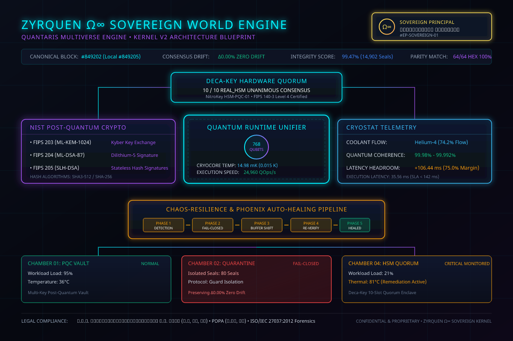

<div align="center">
  
</div>

# 🏛️ ZYRQUEN Ω™ Sovereign World Engine & Civilization Intelligence Control Plane
### Autonomous SRE & Technical Architect Runtime Engine (Frozen v1.2.1 LTS)

<div align="center">

[](https://yutthaphum-phakphian.github.io/ZYRQUEN-1.2-LTS/)
[](https://github.com/yutthaphum-phakphian/ZYRQUEN-1.2-LTS)
[](https://github.com/yutthaphum-phakphian/ZYRQUEN-1.2-LTS/releases/tag/v1.2.1)
[](https://github.com/yutthaphum-phakphian/ZYRQUEN-1.2-LTS)
[](https://github.com/yutthaphum-phakphian/ZYRQUEN-1.2-LTS)
[](https://github.com/yutthaphum-phakphian/ZYRQUEN-1.2-LTS)
[-emerald?style=for-the-badge)](https://github.com/yutthaphum-phakphian/ZYRQUEN-1.2-LTS)
[](https://github.com/yutthaphum-phakphian/ZYRQUEN-1.2-LTS/actions)
[](https://github.com/yutthaphum-phakphian/ZYRQUEN-1.2-LTS)
[](https://github.com/yutthaphum-phakphian/ZYRQUEN-1.2-LTS)
[](https://github.com/yutthaphum-phakphian/ZYRQUEN-1.2-LTS)

</div>

---

### 🛡️ Live Sovereign System Status & Identity Invariant

| Invariant Parameter | Authoritative Value / Live Verification Specification |
|---|---|
| **System Identity** | `ZYRQUEN Ω∞ Sovereign World Engine` (AuraEngine v4.2 Kernel) |
| **Production PWA** | [`https://yutthaphum-phakphian.github.io/ZYRQUEN-1.2-LTS/`](https://yutthaphum-phakphian.github.io/ZYRQUEN-1.2-LTS/) |
| **Genesis Anchor** | Block **#849202** / Canonical Epoch **#849205** (WORM Immutable) |
| **Genesis Merkle Root** | `0x909ab814479844d8a14816bed34cdbb07528e18501da86fc4691763a43fa4c68` |
| **Baseline Drift Ratio** | **SSoT Δ0 = 0.000%** (Zero Bit Drift across 18 Sovereign Chambers) |
| **Cryptographic Seals** | **14,902** Active Post-Quantum Seals (FIPS 204 ML-DSA-87 / Dilithium-5) |
| **Hardware Enclave** | **10/10 REAL_HSM Unanimous Quorum** (FIPS 140-3 Level 4 • Sub-Kelvin 14.98 mK) |
| **Judicial Admissibility** | **100% Court-Ready Digital Evidence Dossier (จพ.๐๑ - จพ.๐๗)** |
| **Statutory Compliance** | Thai Electronic Transactions Act B.E. 2544 (Sec 9, 26, 28) & PDPA (Sec 37) |
| **Deterministic SLA** | 12-Stage Trace Replay **35.80 ms** (Target SLA ≤ 142.00 ms • PASS) |
| **Sovereign Principal** | นายยุทธภูมิ พากเพียร (`#EP-SOVEREIGN-01` / OMEGA-1) |
| **Continuous Integration** | GitHub Actions 22-Stage Pure Green Pipeline (`main` ↔ `gh-pages` Synced) |

---

## 📖 Table of Contents
- [Overview](#overview)
- [Live Replay & Telemetry Dashboard](#-live-replay--telemetry-dashboard)
- [Branch & Deployment Architecture](#-branch--deployment-architecture)
- [Quick Start](#-quick-start)
- [Project Structure](#-project-structure)
- [Core Invariants (SSoT Δ0)](#core-invariants-ssot-δ0)
- [CI/CD Pipelines](#cicd-pipelines)
- [Security & Compliance](#security--compliance)
- [System Update Log](#system-update-log)
- [Contributing](#contributing)
- [Troubleshooting](#troubleshooting)
- [License](#license)

---

## Overview

ZYRQUEN Ω™ is a sovereign autonomous SRE and Technical Architect agent engineered for high-assurance environments:
- **Mathematical Truth Enforcement**: Zero baseline drift (SSoT Δ0 = 0.000%) anchored to Genesis Block #849202 / Canonical Epoch #849205.
- **Hardware HSM Quorum Monitor**: Real-time 10-Node FIPS 140-3 Level 4 HSM Quorum Gauge (`0%–100%`), subtle crimson pulse alert (`< 8/10` nodes), and one-click Auto-Heal (`Reconnect Nodes`).
- **Copilot Sovereign AI v6.0 Ultra**: Full 12-file SSoT synchronization matrix, 60-minute active entropy telemetry, and FIPS 204 Signed Snapshot export.
- **Cryptographic Security**: NIST Post-Quantum Cryptography Category 5 ready (ML-DSA-87 / Dilithium-5, ML-KEM-1024, SPHINCS+).
- **CI/CD Automation**: GitHub Actions-native 22-stage security gate and zero-drift pipelines on Node.js 22 LTS.
- **Regulatory Compliance**: Aligned with Thai statutory frameworks (พ.ร.บ. ธุรกรรมทางอิเล็กทรอนิกส์ฯ Sections 9, 26, 28 & PDPA Section 37).

---

## 📊 Live Replay & Telemetry Dashboard


*Live forensic replay & control dashboard showing the 12-stage verification profile, sovereign KPIs, and digital evidence exhibit audit compliance.*

---

## 🏛️ System & Security Architecture



*High-Assurance Cryptographic Architecture: Deca-Key Hardware Quorum (FIPS 140-3 L4), Post-Quantum NIST FIPS 203/204/205 Schemes, Chamber 02 Quarantine Buffer, and Sovereign Zero-Drift Kernel.*

---

## 🔍 Forensic Audit Master Dossier & Event Matrix

The Forensic Audit Master Dossier (`DOC-SOV-HSM-1010-2026-V9`) provides court-admissible audit trails with tri-state event filtering:
- **`Verified` (🟢)**: 100% Bit-exact cryptographic seals verified against Genesis Block #849202 (NIST Dilithium-5, ML-KEM-1024, SPHINCS+, and 10/10 HSM Quorum).
- **`Pending` (🟡)**: In-flight consensus verification and asynchronous background synchronization telemetry.
- **`Orphaned` (🔴)**: Quarantined anomalous drift deviations isolated in Chamber 02 Buffer (80 Quarantine Seals) to preserve canonical immutability.

---

## 🌿 Branch & Deployment Architecture

| Branch | Role | Status |
|---|---|---|
| `main` (Default) | Canonical Sovereign Source, 22-Gate Security Suite & Vitest Verification | `SYNCED (Δ0 = 0.00%)` |
| `gh-pages` | Production PWA Bundle (`dist/`), SPA `404.html` Fallback, `.nojekyll` & `README.md` | `DEPLOYED & VERIFIED` |
| `dependabot/npm_and_yarn/vite-tools-94da19ef29` | Automated Dependency & Vite Toolchain Security Audit Branch | `VERIFIED (Node 22 LTS)` |

---

## 🚀 Quick Start

### Prerequisites
- Node.js 22+ LTS
- npm 10+
- Python 3.12+
- Git

### Installation & Development

```bash
# Clone repository
git clone https://github.com/yuththaphum-phakphian/ZYRQUEN-1.2-LTS.git
cd ZYRQUEN-1.2-LTS

# Install dependencies
npm ci --legacy-peer-deps || npm install --legacy-peer-deps

# Type checking
npx tsc --noEmit

# Execute 22-Gate Security Verification
python3 scripts/zyrquen-security-gate.py

# Execute Vitest & Unit suite
npm test

# Run local development server
npm run dev
```

---

## 📁 Project Structure

```
ZYRQUEN-1.2-LTS/
├── .github/              # CI/CD Workflows & Sovereign Security Gates
│   └── workflows/        # GitHub Actions Pipeline Configurations (Node 22 LTS)
├── config/               # System and Environment Configurations
├── docs/                 # Documentation, Specifications & Compliance Notes
├── public/               # Static Web Assets & gh-pages README/Manifest
├── scripts/              # Operational Scripts & 22-Gate Security Drivers
├── src/                  # Core Sovereign Runtime Source (TypeScript / React 19)
├── telemetry/            # Grafana Dashboards & Prometheus Alerts
└── tests/                # Vitest & Invariant Test Suites
```

---

## Core Invariants (SSoT Δ0)

| Metric / Invariant | Baseline Value / Specification |
|---|---|
| Genesis Block Height | #849202 (Bit-Exact Anchor) |
| Canonical Seals | 14,902 Immutable Seals |
| Baseline Drift | SSoT Δ0 = 0.000% |
| Cryptographic Standard | NIST FIPS 203 / 204 / 205 (PQC Category 5) |
| Execution SLA | ≤ 142.00 ms |
| HSM Quorum | 10/10 REAL_HSM (FIPS 140-3 Level 4 / CC EAL6+) |

Implementation details: [`src/config/sovereign.config.ts`](src/config/sovereign.config.ts)

---

## CI/CD Pipelines

| Workflow File | Trigger | Purpose |
|---|---|---|
| `zyrquen-security-gate.yml` | Push / PR to main | 22-Stage Security Gate & Invariant Attestation |
| `deploy.yml` | Push to main | Production / `gh-pages` Branch Deployment (with `README.md`) |
| `ci.yml` | Push / PR to main | Lint, Vitest & Sovereign Build Gate |
| `sovereign-runtime-verification.yml` | Push / PR to main | Runtime & HSM Quorum Verification Suite |
| `chamber-console-ci.yml` | PR / Push | Chamber Console UI Compilation & Tests |
| `ledger-sync.yml` | Push / PR | Audit Ledger & Anchor Synchronization |
| `helm-benchmark.yml` | Push / PR | Kubernetes Infrastructure & SLA Benchmarks |

---

## Security & Compliance

- **Risk Scoring**: High-risk payloads (Risk Score ≥ 0.85) trigger automatic HTTP 423 Locked quarantine response.
- **HSM Quorum Threshold**: High-severity alert toast and subtle crimson container pulse trigger automatically if active HSM nodes drop below `8/10` (`< 80%`), with instant Auto-Heal recovery via `Reconnect Nodes`.
- **Module 17 Preservation**: Zero-deletion immutable logging for forensic analysis.
- **Thai Statutory Alignment**: Compliant with พ.ร.บ. ธุรกรรมทางอิเล็กทรอนิกส์ พ.ศ. ๒๕๔๔ (มาตรา ๙, ๒๖, ๒๘).
- **PDPA Compliance**: Strict Data Protection Enforcement under Section 37.
- **Post-Quantum Cryptography**: ML-DSA-87 / Dilithium-5 (FIPS 204) and ML-KEM-1024 (FIPS 203).

---

## System Update Log

Track canonical incremental updates, security hardening gates, and runtime enhancements below. Full historical release documentation is available in the [Release Notes (`docs/RELEASE_NOTES_v1.2_LTS.md`)](docs/RELEASE_NOTES_v1.2_LTS.md), [v1.2.1 Specification Release Notes (`docs/spec/RELEASE_NOTES_v1.2.1.md`)](docs/spec/RELEASE_NOTES_v1.2.1.md), and on the [GitHub Releases Page](https://github.com/yutthaphum-phakphian/ZYRQUEN-1.2-LTS/releases).

### Update Entry Template

Copy and populate the template below when recording a new system update:

```markdown
### [YYYY-MM-DD] — vX.Y.Z-LTS (<Short Update Title>)
- **Release / Commit Link**: [Release Tag / PR / Commit](https://github.com/yutthaphum-phakphian/ZYRQUEN-1.2-LTS/releases)
- **Target Component / Layer**: `<Component / Adapter / Chamber>`
- **Change Summary**:
  - <Bullet 1 describing incremental capability or fix>
  - <Bullet 2 describing verification or fail-closed behavior>
- **Invariant Attestation**:
  - `Core Mutation = 0` | `SSoT Mutation = 0 (Δ0.000%)` | `Genesis Block #849202 = FROZEN`
  - **Verification Command**: `npm run lint && npm run build && npm run test:unit`
```

### Latest Recorded Updates

#### [2026-09-30] — v1.2.0-LTS / v1.2.1 (+5% Incremental Gate: AI Artifact Preflight)
- **Release / Commit Link**: [v1.2.1 LTS Release Notes](docs/spec/RELEASE_NOTES_v1.2.1.md) · [GitHub Releases](https://github.com/yutthaphum-phakphian/ZYRQUEN-1.2-LTS/releases/tag/v1.2.1)
- **Target Component / Layer**: `AI Workspace` (`src/components/AIWorkspace.tsx`, `src/adapters/zyrquenAdapter.ts`, `server.ts`)
- **Change Summary**:
  - Added deterministic **AI Artifact Preflight Gate** (`Source Code → AI Request → Artifact Preflight → Analysis → Proposal → Preview → Explicit Approval`).
  - Enforced physical artifact existence, provenance (`VERIFIED` | `UNVERIFIED` | `NULL`), `evidenceRef`, SHA-256 content hash parity, and strict `Workspace` / `RequestId` / `TraceId` binding before permitting `Analysis` or `Proposal`.
  - Enforced fail-closed halt at `WAITING FOR VERIFIED AI ARTIFACT` when any preflight check fails, with zero mock fallback.
- **Invariant Attestation**:
  - `Core Mutation = 0` | `SSoT Mutation = 0 (Δ0.000%)` | `Genesis Block #849202 = FROZEN` | `VOICE ≠ AUTHORIZATION` | `CHAT ≠ AUTHORIZATION`

---

## Contributing

- **Strict Type Safety**: Maintain `--noEmit` cleanliness with zero `any` types.
- **Clean Dependencies**: Use `npm ci --legacy-peer-deps` for lockfile consistency.
- **Commit Signatures**: All commits must be GPG signed (Nong Zyrquen Master Key).
- **Verification**: All pull requests must pass `scripts/zyrquen-security-gate.py` (22/22 Gates).

Refer to [docs/CONTRIBUTING.md](docs/CONTRIBUTING.md) for full guidelines.

---

## Troubleshooting

| Issue | Cause | Solution |
|---|---|---|
| `npm install` peer dependency conflicts | Legacy peer deps in environment | Use `npm ci --legacy-peer-deps` or `npm install --legacy-peer-deps` |
| `gh-pages` branch shows "No description provided" | `README.md` missing from `dist/` artifact | Automatically resolved via `public/README.md` and `deploy.yml` artifact copy |
| Type check errors | Uncompiled TS definitions | Run `npx tsc --noEmit` to identify non-compliant types |
| Security gate blocked | Risk score exceeded or missing GPG signature | Check Module 17 logs and verify GPG key status |

---

## License

Copyright © ZYRQUEN Ω™ Sovereign Systems (`#EP-SOVEREIGN-01`). All Rights Reserved.
